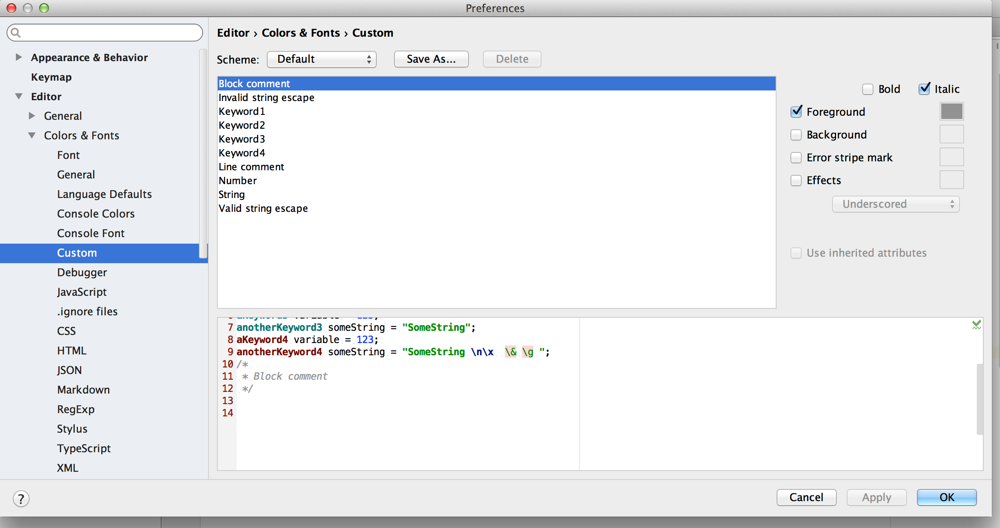
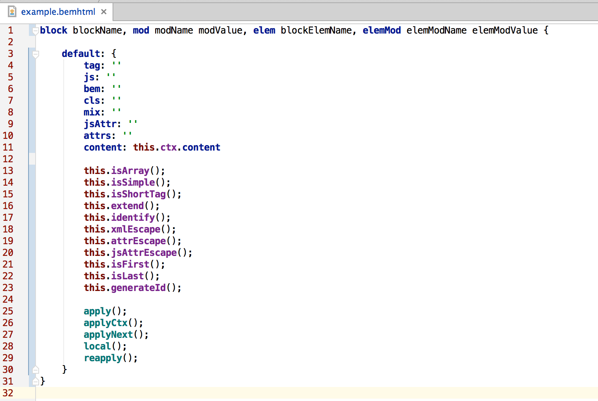

# Подсветка (старого) синтаксиса bemhtml для IntelliJ IDEA / WebStorm

## Установка (OS X)

1. Скопируйте файл `bemxjst.xml` в одну из директорий, в зависимости от используемого редактора:
  - ~/Library/Preferences/IntelliJIdea14/filetypes/
  - ~/Library/Preferences/WebStorm9/filetypes/
  - C:\Users\%username%\.WebStorm10\config\filetypes
2. Перезапустите редактор
3. Удостоверьтесь, что всё работает
  
4. Настройте цвета по вкусу
  

## Пример

